```{r setup, include=FALSE}
knitr::opts_chunk$set(echo = TRUE,
                      collapse = T,
                      error = T)
```

# R 元编程（**metaprogramming**）笔记

> 元编程概念：编写运行时动态修改程序本身的代码（编写产生代码的代码）【使用编程语言来操作或修改自己的代码,代码就是数据】

R中进行元编程的操作可以使用`base R`中的函数，也可以使用`rlang`函数【tidyverse用的就是这个】，当然，`data.table`也有自己的元编程。

通过操作命令与执行环境，操作自己的代码

## base R

### call函数

call函数构建一个命令（**function call**），其第一个参数必须是一个字符串，指明需要被构建的命令，其余参数都会被传递给新生成的命令。

```{r,}
cl <- call("round",1.11)
cl
class(cl);typeof(cl)
identical(cl,quote(round(1.11)))
is.call(cl) && is.language(cl)
eval(cl)
(cl_list <- as.list(cl))
as.call(cl_list)
mode(cl_list) <- "call";cl_list
```

`do.call(what, args, quote = FALSE, envir = parent.frame())`命令则是直接在`envir`中执行`call`命令。

### 捕获代码

`quote(expr)`函数捕获未执行的代码。`enquote(cl)`捕获代码的运行结果,cl为`call`对象。

```{r}
quote(1:9 + 2)
enquote(1:9 + 2)
```

如果希望捕获代码中，某些变量名被替换为对应的值，可以使用`substitute(expr, env)`,**`substitute`**函数除了需要捕获的代码，还可以传递一个替换环境**env**（可以是`列表`、`数据框`、`执行环境`等）参数，此时代码中的变量名如果在**env**中有对应的值，则会被替换为相应的值，除非**env**是全局执行环境。

如果只希望特定的变量名可以被替换，而非所有在执行环境中存在的变量都会被替换，则可以使用`bquote`函数，该函数定义了一种特殊的语法格式------所有被包含在**`.()`**中的变量名才会被替换。

```{r}
substitute(a + b, list(b = 1))
substitute(a + b, baseenv())
b <- 1;substitute(a + b, globalenv())
bquote(x <- .(x) + 1, list(x = 1:9))
```

### eval执行代码

`eval(expr, envir, enclos)`执行捕获的代码，其中**envir**是代码中变量名的首要查找位置，**envir**中查找不到的变量名会在**enclos**中查找。

在指定的环境中计算R表达式。

```{r}
在指定的环境中计算R表达式
#local函数默认情况下会在一个临时执行环境中执行代码，可以有效的舍弃运算过程中产生的中间变量，返回最后一行表达式，类似函数。
local({
  a <- 1:9;
  b <- a
},envir = new.env())
a;b
```

由操作符`~`构成的命令，被捕获或执行后结果是一致的，唯一的区别在于**～**被捕获后产生的结果没有属性（**attributes**）部分，但无论何种情况我们可以像操作命令树一样取出**\~**前后的内容，所以**`~`**经常被用作捕获代码的便捷操作符号。

```{r}
str(eval(y~x))
str(quote(y~x))
```

命令集（**expression**）本身就是未被执行的命令的集合，所以被捕获之后生成的是一个生成该命令集的命令，需要被执行两次才能取出执行结果。

<https://blog.csdn.net/songzhilian22/article/details/49487467>

<https://blog.csdn.net/songzhilian22/article/details/49487467>

```{r}

```
